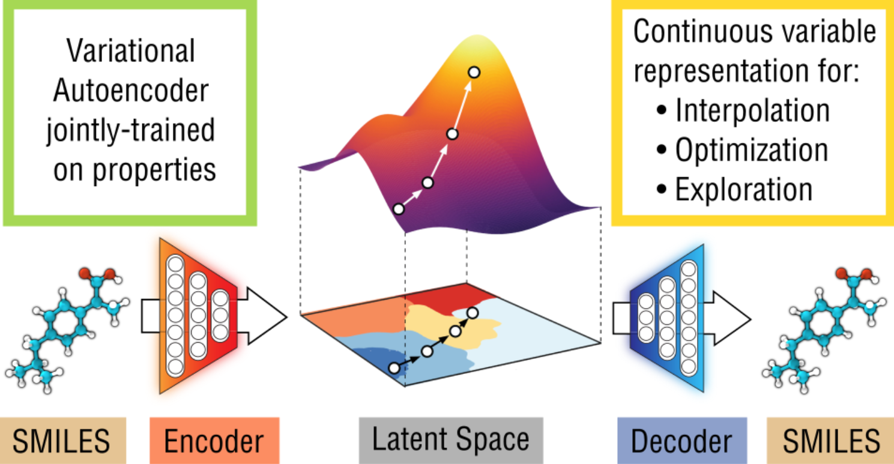

# Abstract

我々は、分子の離散的な表現を多次元の連続的な表現に変換する方法を報告する。このモデルを用いることで、新しい分子を生成し、化合物のオープンエンドな空間を効率的に探索・最適化することができる。本研究では、数十万件の既存の化学構造を用いて深層ニューラルネットワークを学習し、***エンコーダ、デコーダ、予測器の3つの結合機能を構築した。*** エンコーダーは、分子の離散的な表現を実数値の連続ベクトルに変換し、デコーダーは、この連続ベクトルを離散的な分子表現に戻す。予測器は、分子の潜在的な連続ベクトル表現から化学的性質を推定する。分子を連続的に表現することで、ランダムなベクトルの復号化、既知の化学構造の擾乱、分子間の補間など、潜在空間で簡単な操作を行うだけで、新規の化学構造を自動的に生成することができる。また、***連続的に表現することで、強力な勾配ベースの最適化が可能となり、最適化された機能性化合物の探索を効率的に行うことができる。*** 我々の手法は、薬物のような分子の領域と、9個以下の重原子を持つ分子のセットで実証されている。
 
 

# Introduction
### **モチベーション**
* ドラッグデザインやマテリアルデザインの目的は望ましい特性を持つ新規分子を発見すること.
* これを **最適化問題** と捉え, 定量的な欲求を最大化する分子を探すことがモチベーション.
* しかし分子空間での最適化は, 以下の２つの理由から非常に困難
    * 探索空間が大きく, 離散的で非構造的である.
    * これまでに合成された物質が約  種類であるのに対し, 薬のような分子の候補は  〜  種類と推定されている.
* 離散的な最適化は勾配による探索空間のガイドができないので困難.
* 連続性のある分子表現を用いるメリットは, 
    * ベクトル表現を修正してデコードすることで新しい化合物を自動的に生成できるため, **手作業による変異ルールが不要になる** ,
    * 分子表現から望ましい特性へとマッピングする**微分可能なモデルを開発すれば, 勾配ベースの最適化を利用して化学空間でより大きなジャンプをすることが可能**になる. これは**ベイズ推論のようなアプローチと組み合わせることで効率的な探索が可能**となる,
    * 大規模データを用いたデータドリブンモデルは外部の小さなデータセットにも適用可能.  
 

### **新規性**
* SMILES文字列を用いた深層生成モデル
* オートエンコーダの学習と同時に, エンコーダが生成した連続表現から物性値を予測する多層パーセプトロンを追加し, その回帰誤差を損失関数に含めた.
* 原理的には, グラフ, 画像なども分子表現にも応用可能

